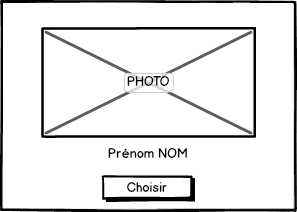
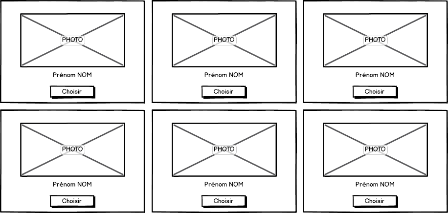

# TP #5.2.2 - Composants

## ChoixStagiaireComponent

* Générer un composant `ChoixStagiaire`.

```
ng g component ChoixStagiaire
```

* Modifier le contenu du composant App (`app.component.html`) comme suit :

```html
<app-choix-stagiaire></app-choix-stagiaire>
```

* Tester l'application et vérifier l'affichage du composant.

## BandeauComponent

* Créer un composant `BandeauComponent` qui affiche un titre et une description.


* Modifier la page `ChoixStagiaire` pour intégrer le composant `BandeauComponent`.


## StagiaireComponent

* Créer un composant `StagiaireComponent`.



* Ce composant prend en entrée un objet de type `Stagiaire` (`@Input`)
    * Ajouter un fichier `src/app/domains.ts`.
    * Ajouter y une classe `Stagiaire` avec les informations d'un stagiaire.
    
* Un clic sur le bouton `Choisir` affiche dans la console le nom et le prénom du stagiaire.

## ListeStagiairesComponent

* Créer un composant `ListeStagiairesComponent` qui, à partir d'une liste d'objets stagiaires, produit l'affichage suivant :



* Ce composant a un champ de type tableau d'objets Stagiaires.

* Modifier la page `ChoixStagiaire` pour intégrer le composant `ListeStagiairesComponent`.


