# TP #5.4 - Routeur

## Examens

### `/` 

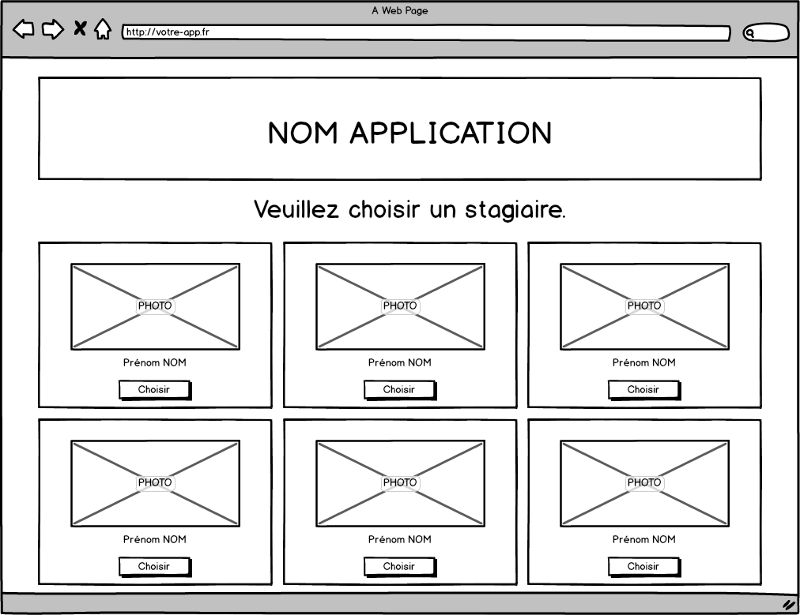

### `/{id_stagiaire}/examens/`

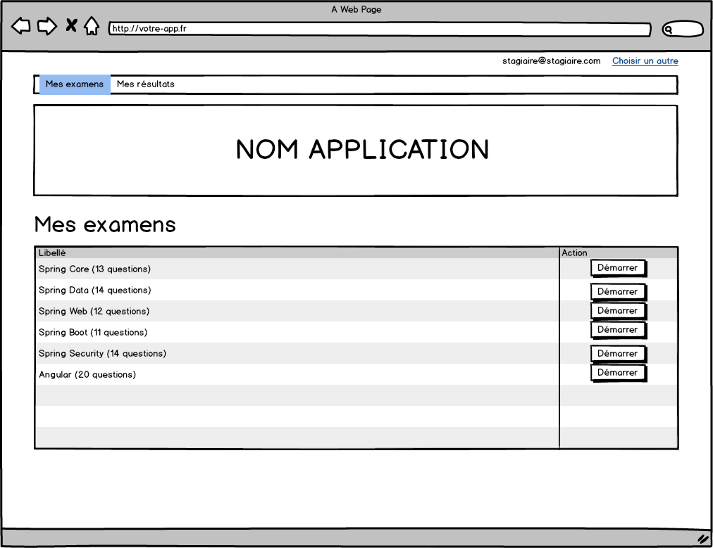

### `/{id_stagiaire}/resultats`

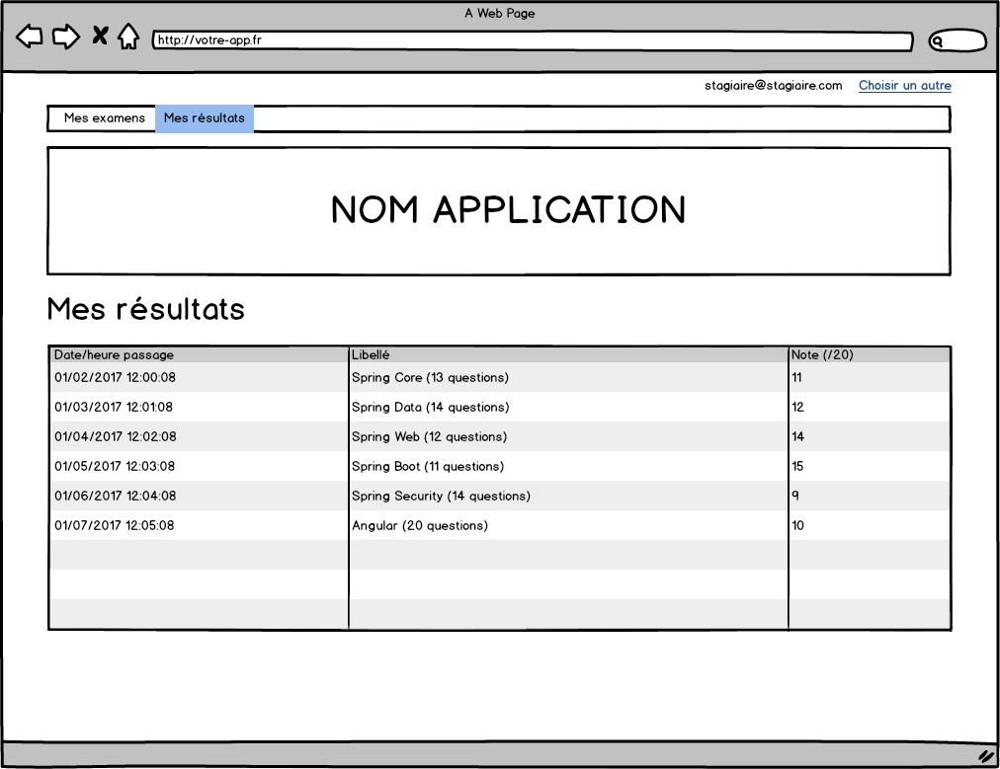

### `/{id_stagiaire}/resultats/{id}`

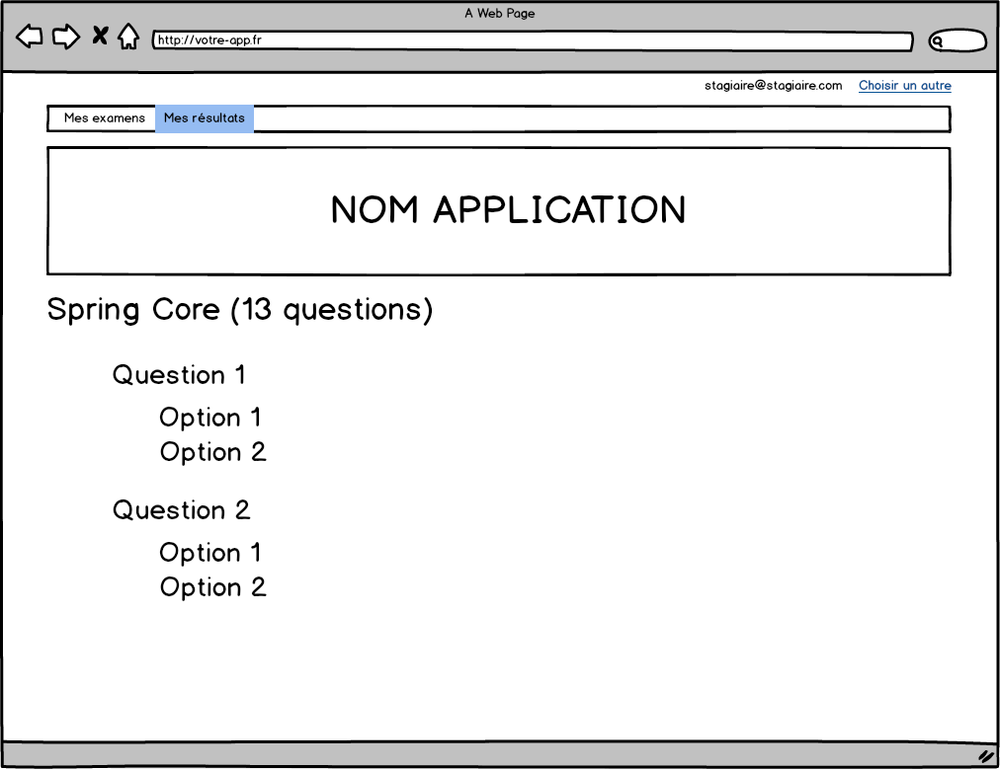

### Changer de stagiaire

Le lien `Choisir un autre` permet de revenir à la page de choix du stagiaire.

## Sondages

### `/` 

### `/{id_stagiaire}/sondages`

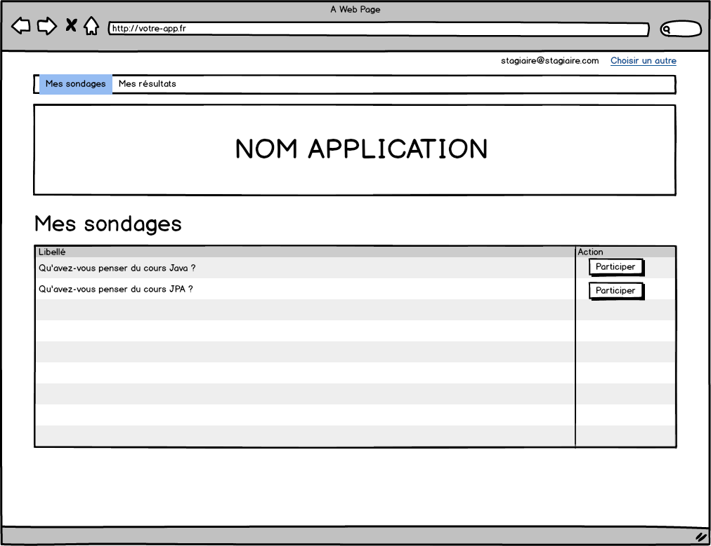

### `/{id_stagiaire}/resultats`

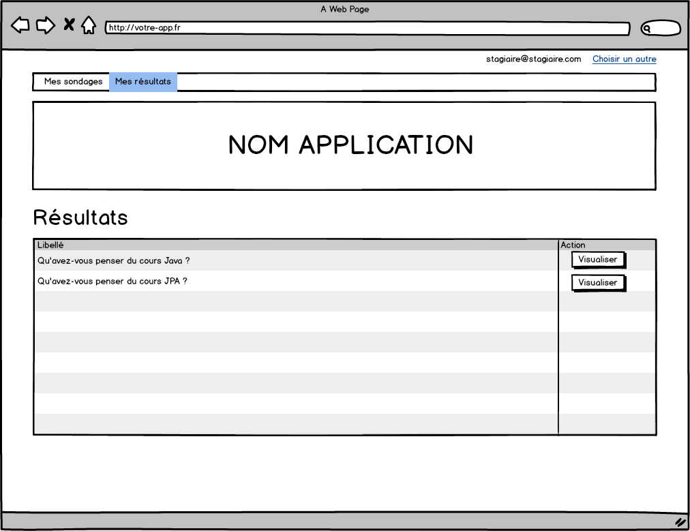

### `/{id_stagiaire}/resultats/{id}`

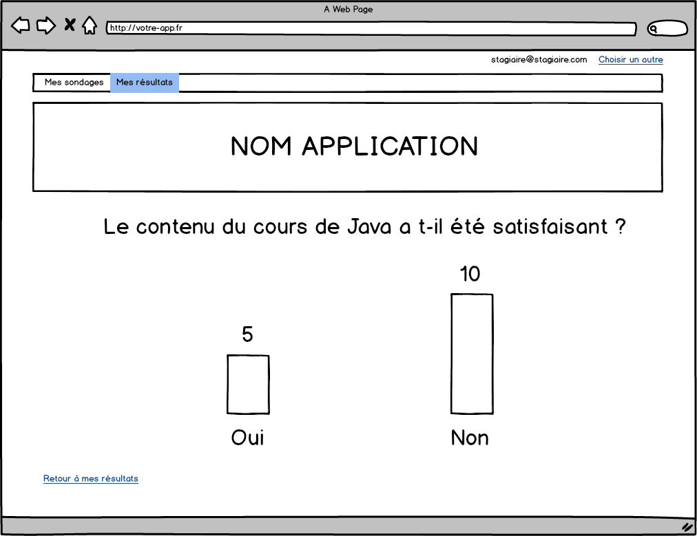

### Changer de stagiaire

Le lien `Choisir un autre` permet de revenir à la page de choix du stagiaire.

## Duels

### `/` 

### `/{id_stagiaire}/duels`

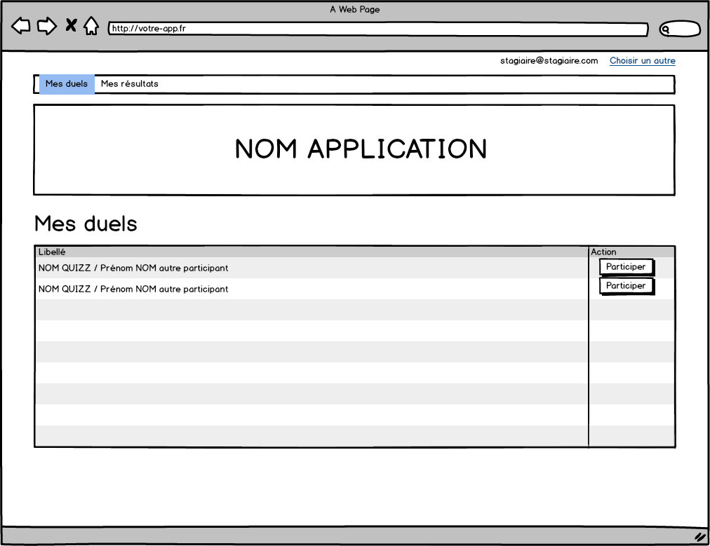

### `/{id_stagiaire}/resultats`

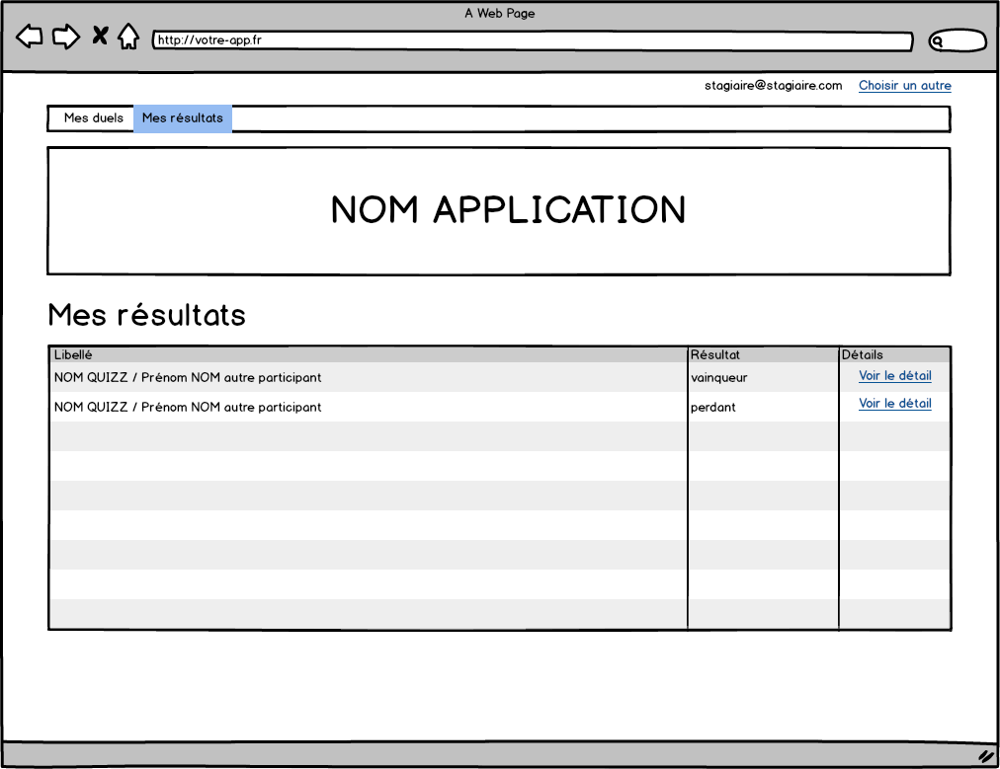

### `/{id_stagiaire}/resultats/{id}`

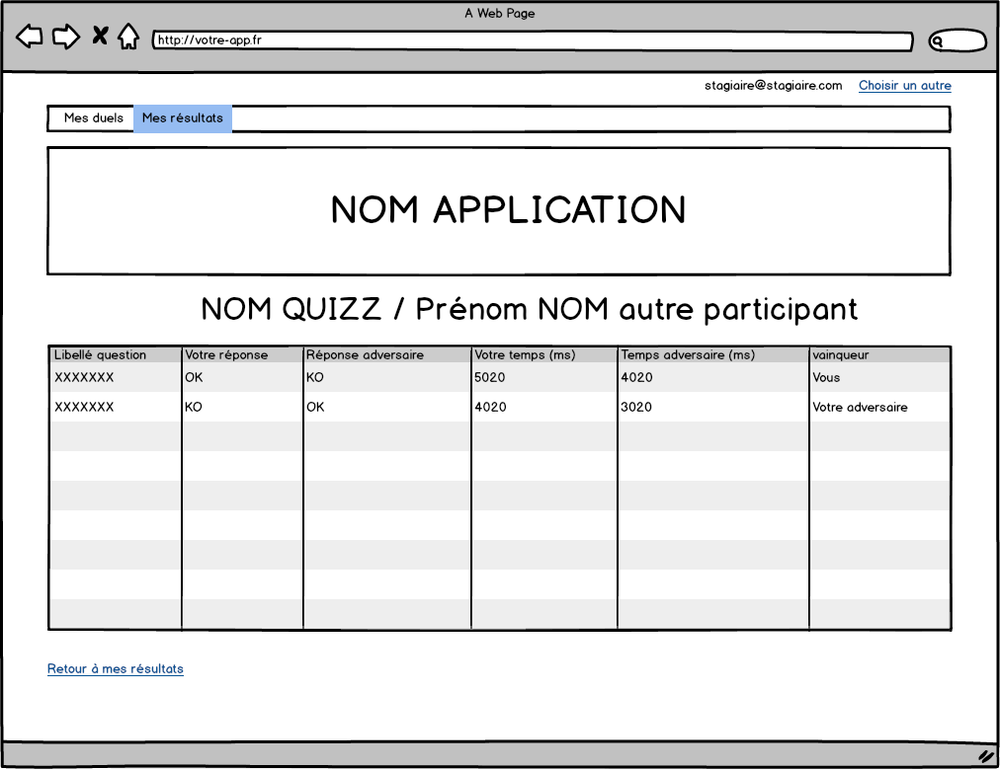

### Changer de stagiaire

Le lien `Choisir un autre` permet de revenir à la page de choix du stagiaire.

## Concours

### `/` 

### `/{id_stagiaire}/concours`

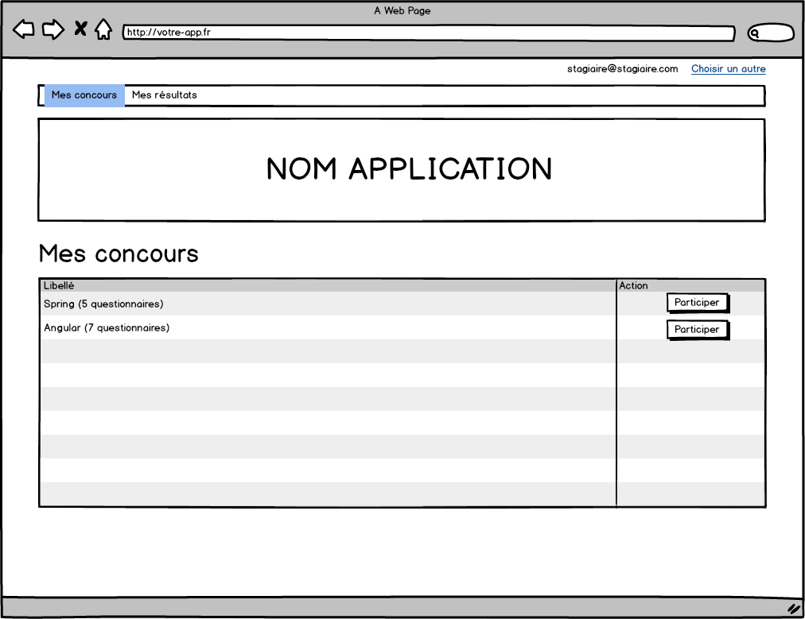

### `/{id_stagiaire}/resultats`

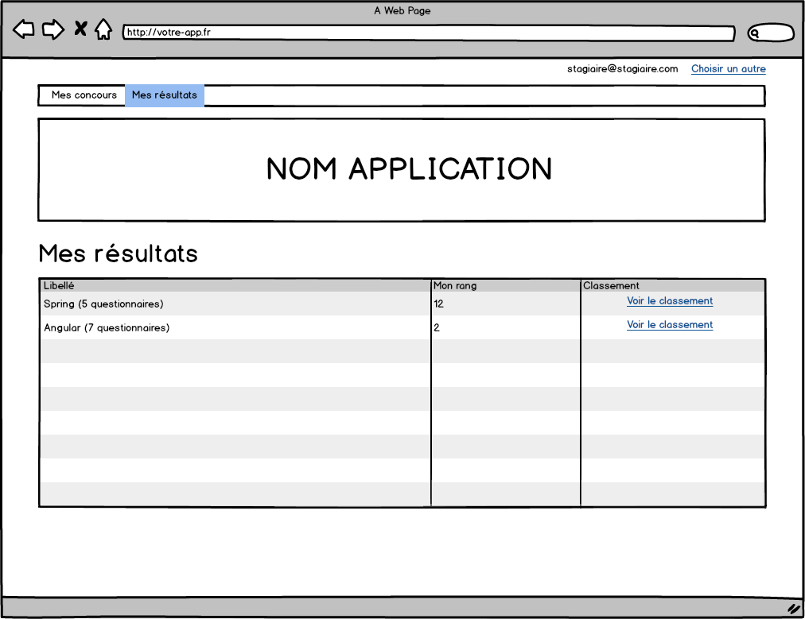

### `/{id_stagiaire}/resultats/{id}`

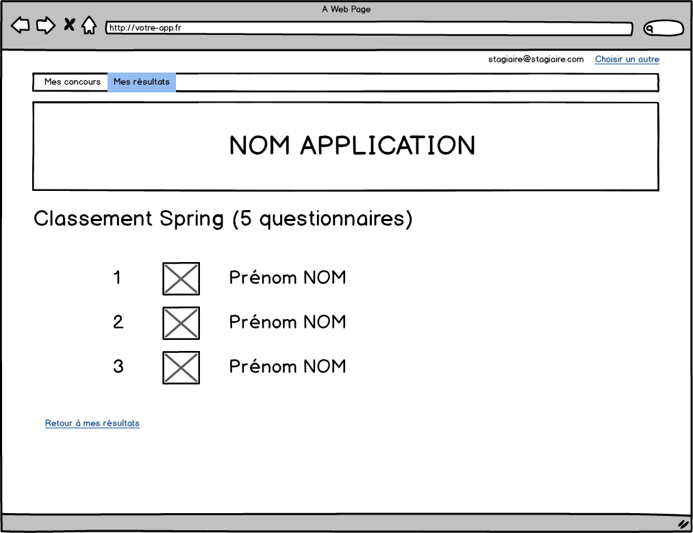

### Changer de stagiaire

Le lien `Choisir un autre` permet de revenir à la page de choix du stagiaire.