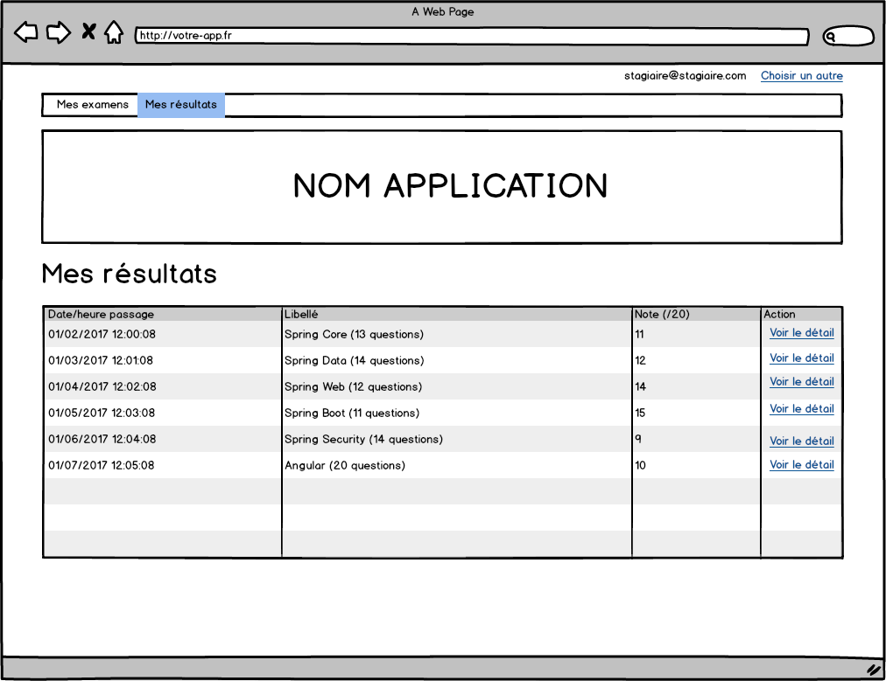

# TP #5.4 - Routeur

## Examens

### `/` 

### `/examens`

### `/resultats`

### `/resultats/{id}`

### Changer de stagiaire

Le lien `Choisir un autre` permet de revenir à la page de choix du stagiaire.

## Sondages

### `/` 

### `/sondages`

### `/resultats`

### `/resultats/{id}`

### Changer de stagiaire

Le lien `Choisir un autre` permet de revenir à la page de choix du stagiaire.

## Duels

### `/` 

### `/duels`

### `/resultats`

### `/resultats/{id}`

### Changer de stagiaire

Le lien `Choisir un autre` permet de revenir à la page de choix du stagiaire.

## Concours

### `/` 

### `/concours`

### `/resultats`

### `/resultats/{id}`

### Changer de stagiaire

Le lien `Choisir un autre` permet de revenir à la page de choix du stagiaire.