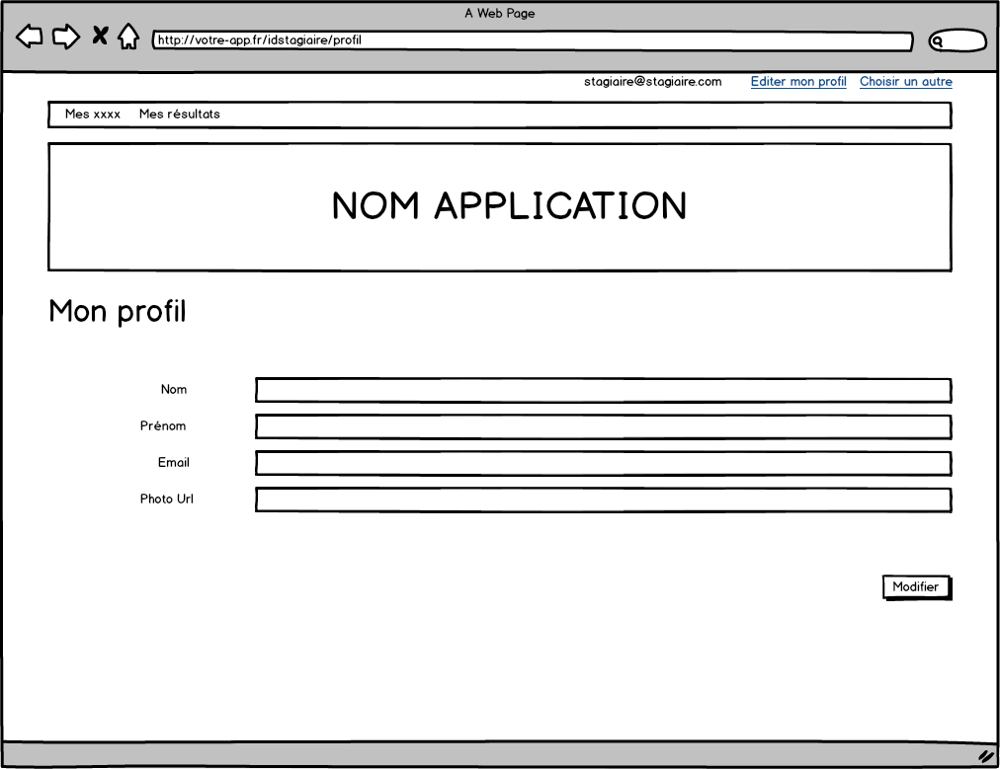
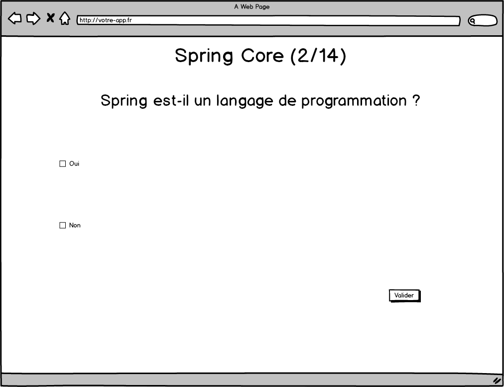
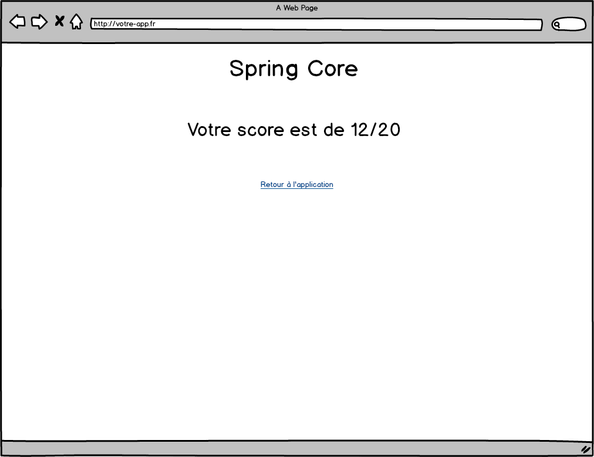
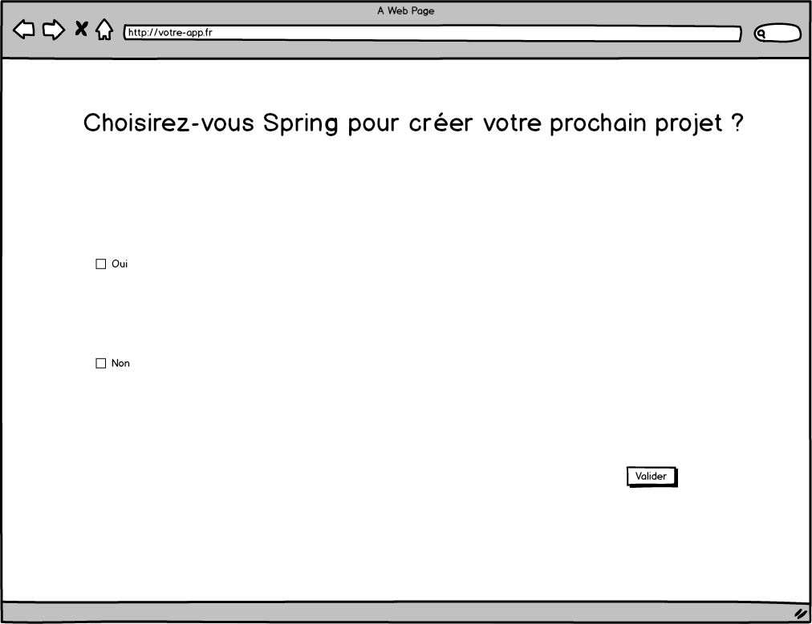

# TP #5.5 - Formulaire

## Editer les informations du stagiaire

* Ajouter un lien d'édition du profil stagiaire.

* Créer un formulaire d'édition du stagiaire.

Ce formulaire est prérempli à l'affichage.

Les contraintes :
* Tous les champs sont obligatoires.
* Le nom et le prénom doivent avoir au moins 2 caractères.
* Le bouton `Modifier` n'est actif que si tous les champs sont valides. 

Gérer les erreurs du serveur.

Dans le cas où le stagiaire a bien été mis à jour côté serveur, rediriger l'utilisateur ve.

## Réponses aux questions

Créer la mécanique de réponse aux examens, sondages, concours et duels.

### Exemple pour examen, concours et duel.

 

## Exemple sondage.

